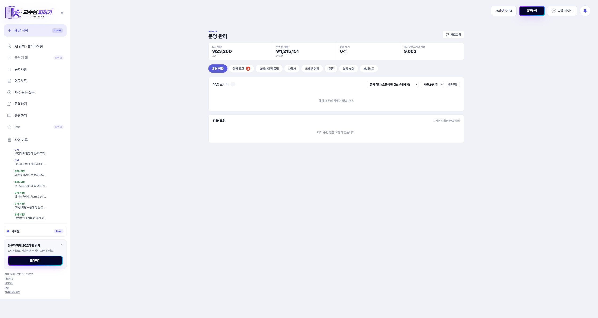
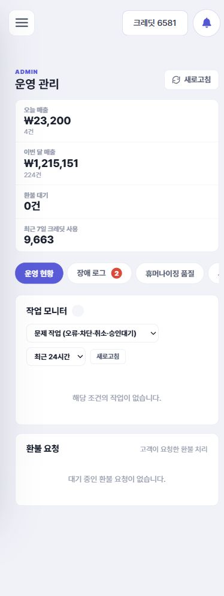
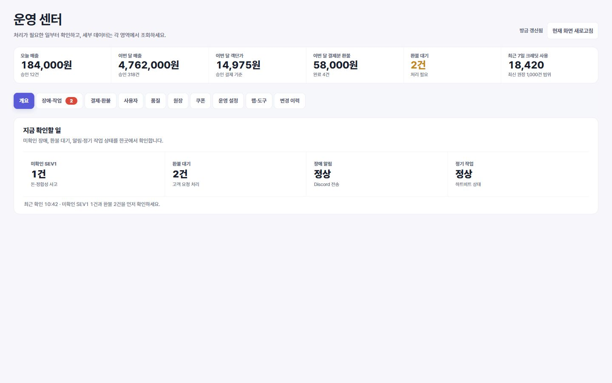
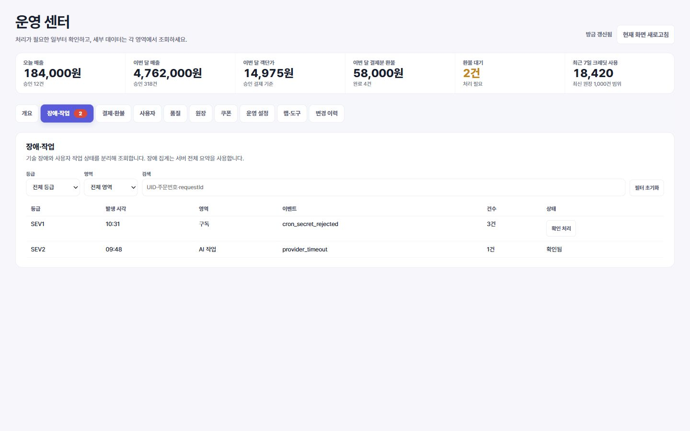

# 관리자 운영 센터 UI·기능 고도화

- 작업일: 2026-08-30
- 기준: Frontend 운영 커밋 `484d83ac89ac`
- 작업 브랜치: `feat/admin-operations-v2-20260830`
- 범위: 관리자 화면의 정보 구조, 조회·필터, 접근성, 반응형, 데이터 표기, 운영 변경 안전장치
- 운영 배포: 하지 않음

## 1. 결론

기존 화면은 운영 데이터가 한곳에 길게 쌓이고, 첫 진입 시 보이지 않는 탭의 데이터까지 모두 요청했습니다. 이번 변경은 관리자 업무 순서를 기준으로 화면을 다시 나누고, 실제로 선택한 영역만 불러오도록 바꿨습니다. 사용자 검색 결과가 뒤늦게 도착해 다른 계정에 크레딧을 조정할 수 있던 경합도 차단했습니다.

첫 화면은 이제 `현재 상황 파악 → 처리할 일 선택 → 세부 조회` 흐름을 따릅니다. 단순 효과 부족과 실제 품질 경고, 장애와 사용자 작업, 운영 설정과 실험 도구도 서로 분리했습니다.

### 감사에서 확인한 핵심 문제와 처리

| 우선도 | 확인한 문제 | 처리 결과 |
| --- | --- | --- |
| P1 | 관리자 진입만 해도 품질 2,000건·원장 1,000건 등 숨은 탭까지 동시에 요청 | 현재 탭만 지연 조회하고 45초 이내 재방문만 캐시 |
| P1 | 사용자 A 조회 중 B로 바꾸면 A의 늦은 응답이 B 화면을 덮을 수 있음 | 검색·작업 기록별 AbortController와 세대 번호 적용 |
| P1 | 장애·작업·품질 필터를 빠르게 바꾸면 이전 응답이 최신 결과와 페이지 상태를 덮을 수 있음 | 영역별 독립 취소·세대 검사와 최신 요청 전용 busy 해제 적용 |
| P1 | 로더가 화면 안에서 오류를 처리하면 탭은 성공으로 판단해 45초간 오류 화면을 캐시 | DOM 오류 상태와 rejected 결과를 함께 판단하고 실패 시 캐시·갱신 시각 미기록 |
| P1 | 실제 최근 조회분을 `누적`, 최근 1,000건을 `전체`처럼 표시 | 서버 계약에 맞게 `최근 조회분`, `최신 1,000건 범위`로 정정 |
| P1 | 작업 상세가 가로 스크롤 표 안에서 잘리고 모바일에서 닫기 어려움 | 뷰포트 고정 패널, 최대 높이, 닫기·ESC·한 번에 하나 열기 적용 |
| P2 | 탭·라벨·표 설명·터치 영역과 모바일 품질 필터 배치가 불완전 | ARIA 관계, 키보드 이동, caption/scope, 44px 조작 영역, 한 열 재배치 적용 |
| P2 | 환불 승인과 거절을 동시에 누르거나 저장 버튼을 중복 실행할 여지 | 동일 주문 공통 잠금과 버튼 busy 잠금 적용 |

백엔드의 과금·환불·크레딧 계약은 변경하지 않았습니다. 조회 한계가 있는 값은 프런트에서 정확히 고지했고, 전체 누적 집계나 서버 커서가 필요한 항목은 아래 후속 작업으로 분리했습니다.

## 2. 전후 비교

| 구분 | 변경 전 | 변경 후 |
| --- | --- | --- |
| 첫 화면 | 작업 모니터와 환불 목록이 길게 이어짐 | 매출·객단가·환불·크레딧 KPI와 즉시 처리 항목 우선 |
| 메뉴 | 운영 현황, 장애 로그, 품질, 사용자, 원장, 쿠폰, 설정·실험, 패치노트 | 개요, 장애·작업, 결제·환불, 사용자, 품질, 원장, 쿠폰, 운영 설정, 랩·도구, 변경 이력 |
| 데이터 요청 | 진입과 동시에 숨은 영역까지 전부 호출 | 개요와 현재 탭만 호출, 탭별 45초 캐시와 수동 갱신 |
| 사용자·운영 조회 | 늦게 도착한 이전 검색·필터 응답이 최신 화면을 덮을 수 있음 | 사용자·원장·장애·작업·품질별 요청 취소와 세대 번호로 최신 응답만 채택 |
| 운영 변경 | 저장·조정·승인 버튼 중복 실행 가능 | 처리 중 잠금, 대상 UID 재확인, 환불 건별 잠금 |
| 원장 표기 | “전체”로 보이지만 실제 최근 1,000건 | “최근 크레딧 원장”과 조회 상한을 명시 |
| 장애 배지 | 최근 80개 목록만 세어 과소 집계 가능 | 서버 전체 요약의 미확인 SEV1 사용 |
| 모바일 | 탭 잘림 안내 부족, 작은 버튼, 고정 폭 표 | 가로 탭 탐색, 44px 터치 영역, 내부 표 스크롤 |
| 접근성 | 탭·라벨·표 설명 부족 | tablist/tabpanel, 키보드 이동, label, caption, scope |

### 변경 전

### 변경 후

아래 화면의 수치는 레이아웃 검증용 예시이며 운영 데이터가 아닙니다. 실제 화면은 기존 관리자 API의 응답으로 채워집니다.

## 3. 구현 내용

### 운영 개요

- 오늘·이번 달 매출, 이번 달 객단가, 이번 달 환불액·건수, 환불 대기, 최근 7일 크레딧 사용을 한 줄 KPI로 구성했습니다.
- 미확인 SEV1, 환불 대기, Discord 알림, 정기 작업 하트비트를 `지금 확인할 일`로 묶었습니다.
- 전체 페이지 새로고침 대신 현재 탭만 새로 불러오며 마지막 갱신 시각을 표시합니다.

### 필터와 조회

- 장애: 기간·등급·영역·미확인·검색과 초기화.
- 작업: 상태·기간·검색과 상세 엔진 메타.
- 품질: 기간·요청 모드·품질 상태.
- 원장: 기간·유형·페이지 크기와 초기화, 날짜 역전 검증.
- 변경 이력: 버전·기능·커밋 검색, 상태 필터, 모두 펼치기·접기.
- 사용한 필터는 같은 브라우저 세션에서 탭 이동 후에도 복원합니다.
- 장애·작업·품질에는 필터 초기화를 제공하며 화면 값과 저장된 필터 상태를 함께 초기화합니다.
- 품질 화면은 기간 필터가 상단 전체 지표에, 모드·품질 필터가 교차표와 최근 작업에 적용된다는 범위를 화면에 명시합니다.

### 데이터 정확성

- 원장과 장애 목록이 일부 범위 조회라는 사실을 화면에 명시합니다.
- 작업 상세에 엔진 버전, 요청 모드, 문서 프로필, 처리 시간, 길이비, 실질 편집률, 승인/실패 청크, 구조·한국어·품질·효과 상태와 비용을 표시합니다.
- 사용자 요약에 결제 건수, 순결제액, 환불액, 사용 크레딧을 추가했습니다.
- 사용자 결제·사용 합계가 서버의 최근 조회분 기준임을 명시해 누적값으로 오해하지 않게 했습니다.
- 최근 7일 크레딧 사용량은 최신 원장 1,000건 범위라는 조회 한계를 KPI 바로 아래에 표시합니다.
- GPT 설정 입력 상한을 서버 계약인 보호 표현 120개·수동 패치 12개와 맞췄습니다.
- 운영에서 의미가 다른 `운영 설정`과 `랩·도구`를 분리하고, 동작하지 않던 기본 실험 UI를 제거했습니다.

### 안전장치

- 관리자 권한이 확인되기 전에는 관리자 DOM을 숨기고 비활성 상태로 둡니다.
- 사용자 검색은 이전 요청을 취소하고 최신 응답만 반영합니다.
- 장애·작업·품질·원장 필터도 이전 요청을 취소하거나 세대 번호를 비교해 역순 응답이 최신 화면을 덮지 못하게 합니다.
- 일부 로더가 내부에서 오류를 표시하더라도 탭을 성공으로 캐시하지 않으며, 성공한 조회에만 마지막 갱신 시각을 기록합니다.
- 크레딧 조정·알림·쿠폰 발급·환불 승인/거절·장애 확인·설정 저장은 처리 중 다시 누를 수 없습니다.
- 크레딧 조정 직전 현재 선택된 UID를 다시 확인해 검색 결과가 바뀐 상태에서 다른 사용자에게 적용되지 않게 했습니다.

### 반응형·접근성

- 콘텐츠 최대 폭을 1,440px로 넓혀 1,366px 이상 화면의 빈 공간을 줄였습니다.
- KPI는 넓은 화면 6열, 중간 화면 3열, 모바일 2열로 재배치됩니다.
- 탭은 화살표·Home·End 키로 이동할 수 있고 활성 탭, 패널 관계를 보조기기에 전달합니다.
- 하나의 탭에 여러 운영 패널이 있는 경우도 모든 패널 ID를 연결하며, 모션 축소 설정에서는 탭 스크롤 애니메이션을 사용하지 않습니다.
- 모바일 조작 영역은 최소 44px, 필터는 한 열, 표는 페이지가 아니라 표 내부에서 가로 스크롤됩니다.
- 작업 상세는 표 스크롤 영역 밖의 고정 패널로 열리고 닫기 버튼과 ESC, 기존 상세 자동 닫기를 지원합니다.
- 보조 텍스트 색 대비를 높이고 상태색은 전경·배경·테두리 토큰으로 통일했습니다.

## 4. 검증 결과

- 관리자 전용 신규 회귀: 6/6 통과
- 관련 타깃 회귀: 27/27 통과
- 프런트 전체 회귀: 183 통과, 0 실패, 0 스킵
- 운영 빌드: 통과
- `npm audit --omit=dev`: 취약점 0건
- JavaScript 구문 검사: 통과
- `git diff --check`: 오류 없음
- 시각 검증: 1,440×900, 390×844
- 반응형 수치 검증: 320×568, 360×800, 390×844, 430×932, 768×1024, 820×1180, 1024×768, 1180×820, 1366×768, 1440×900, 1920×1080
- 전 뷰포트 페이지 가로 넘침 0건, 820px 이하 조작 영역 높이 44px 이상
- Impeccable 정적 검사: 파서 모듈 부재로 정규식 폴백 실행. 관리자 장애 카드의 두꺼운 한쪽 강조선 2건을 확인해 제거했으며, 폴백 검사는 계산 색 대비·선택자 매칭을 완전히 대체하지 않으므로 브라우저 수치·시각 검증을 함께 사용했습니다.

회귀 테스트는 관리자 권한 전 비노출, 탭별 지연 로딩과 실패 재시도, ARIA·키보드 계약, 사용자·장애·작업·품질·원장 조회 경합, 중복 실행 잠금, 실제 조회 범위 표기, 반응형 토큰을 고정합니다.

## 5. 운영 반영 전에 확인할 항목

- 관리자 계정으로 각 탭을 한 번씩 열어 실제 API 응답과 빈 상태를 확인합니다.
- 사용자 검색 후 크레딧 조정은 관리자 무차감 테스트 계정으로 1회만 확인합니다.
- 환불 승인·거절은 실제 주문에 영향을 주므로 화면·잠금 확인만 하고 운영 데이터 변경 테스트는 별도 승인 후 수행합니다.
- 장애·원장 목록의 서버 커서 기반 페이지네이션은 백엔드 계약 추가가 필요한 후속 작업입니다. 현재는 정확한 조회 상한과 범위를 표시해 오해를 막았습니다.
- 관리자 전용 마크업·JavaScript를 일반 앱 번들에서 완전히 분리하는 작업은 별도 번들 구조 변경으로 진행하는 것이 안전합니다.

## 6. 변경 파일

- `pages/admin.html`: 정보 구조, 탭, KPI, 필터, 라벨, 빈 상태
- `assets/js/app-module.js`: 지연 로딩, 조회 캐시, 필터, 안전 잠금, 운영 데이터 표시
- `assets/css/redesign.css`: 관리자 전용 레이아웃·대비·반응형·접근성 스타일
- `test/admin-operations-ui.test.mjs`: 관리자 UI·운영 안전 계약
- `test/release-a.test.mjs`: 새 관리자 탭 명칭과 설정·랩 분리 회귀
